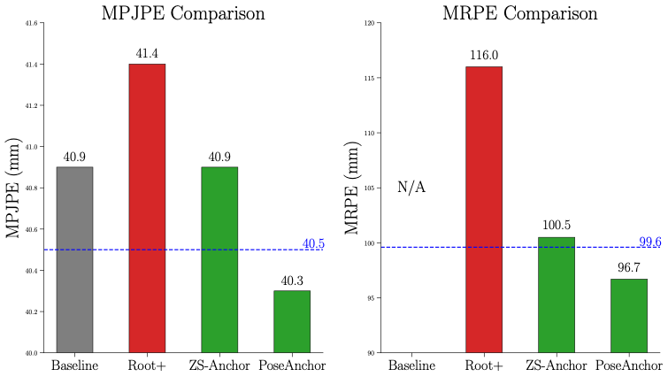

# PoseAnchor: Robust Root Position Estimation for 3D Human Pose Estimation


Official PyTorch implementation of the ICCV 2025 paper:  
**“PoseAnchor: Robust Root Position Estimation for 3D Human Pose Estimation”**

<div align="center">

[](https://openaccess.thecvf.com/content/ICCV2025/papers/Kim_PoseAnchor_Robust_Root_Position_Estimation_for_3D_Human_Pose_Estimation_ICCV_2025_paper.pdf)
[](http://vision.imar.ro/human3.6m/description.php)
[](https://scholar.google.com/citations?user=bItY21sAAAAJ&hl=ko)
[](LICENSE)

</div>

If you find this repository useful for your work, please consider citing:

```bibtex
@inproceedings{kim2025poseanchor,
  title     = {PoseAnchor: Robust Root Position Estimation for 3D Human Pose Estimation},
  author    = {Kim, Jun-Hee and Han, Jumin and Lee, Seong-Whan},
  booktitle = {Proceedings of the IEEE/CVF International Conference on Computer Vision},
  pages     = {7079--7088},
  year      = {2025}
}
```
---


## Environment

The code is developed and tested under the following environment:

- Ubuntu 18.04  
- Python 3.6.10  
- PyTorch 1.8.1  
- CUDA 10.2  

Other versions may also work, but have not been thoroughly tested.

---

## Installation

Clone this repository:

    git clone https://github.com/your_username/PoseAnchor.git
    cd PoseAnchor

(Optional) create a conda environment:

    conda create -n poseanchor python=3.6
    conda activate poseanchor

Install PyTorch (make sure the CUDA version matches your system), for example:

    pip install torch==1.8.1+cu102 torchvision==0.9.1+cu102 -f https://download.pytorch.org/whl/torch_stable.html

Install other dependencies:

    pip install -r requirements.txt

(If you do not provide a `requirements.txt` file, please install dependencies manually according to your local setup.)

---

## Dataset

We follow the Human3.6M dataset setup of [VideoPose3D](https://github.com/facebookresearch/VideoPose3D).  
Please refer to the VideoPose3D repository for detailed instructions on preparing Human3.6M and generating the following `.npz` files.

Expected directory structure:

    ${POSE_ROOT}/
    |-- data
    |   |-- data_3d_h36m.npz
    |   |-- data_2d_h36m_gt.npz
    |   |-- data_2d_h36m_cpn_ft_h36m_dbb.npz

Set `${POSE_ROOT}` to the root directory of this repository.

---

## Training

### Training from scratch

To train PoseAnchor on Human3.6M (243-frame setting) using **two GPUs**, run:

    torchrun --nproc_per_node=2 run.py -c checkpoint

- `--nproc_per_node=2`: number of GPUs for distributed training  
- `-c checkpoint`: configuration / checkpoint directory (modify as needed)

You can change training settings (e.g., window size, batch size, learning rate) in the configuration files loaded by `run.py`.


---

## Results

We report 3D human pose estimation performance on Human3.6M following the standard evaluation protocol used in VideoPose3D.

| Method                | Frames | Protocol | MPJPE (mm) | PA-MPJPE (mm) |
|-----------------------|:------:|:--------:|:----------:|:-------------:|
| VideoPose3D           |  243   |    #1    |    46.8    |     36.8      |
| MixSTE                |  243   |    #1    |    40.9    |     32.6      |
| **PoseAnchor (Ours)** |  243   |    #1    |  **40.3**  |   **32.1**    |

For detailed ablation studies and additional experiments, please refer to the ICCV 2025 paper.

---

## Acknowledgements

We build on the following excellent baselines and codebases:

- [MixSTE](https://github.com/JinluZhang1126/MixSTE)  
- [VideoPose3D](https://github.com/facebookresearch/VideoPose3D)  
- [SimpleBaseline](https://github.com/microsoft/human-pose-estimation.pytorch)  

If you use parts of this repository, please also consider citing these works.


